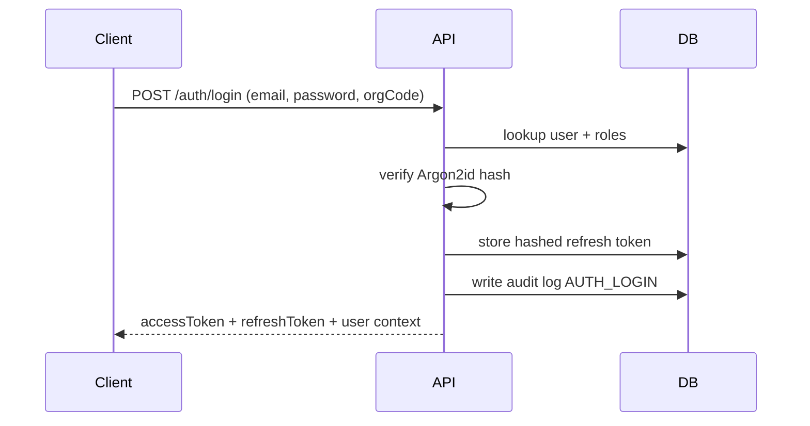
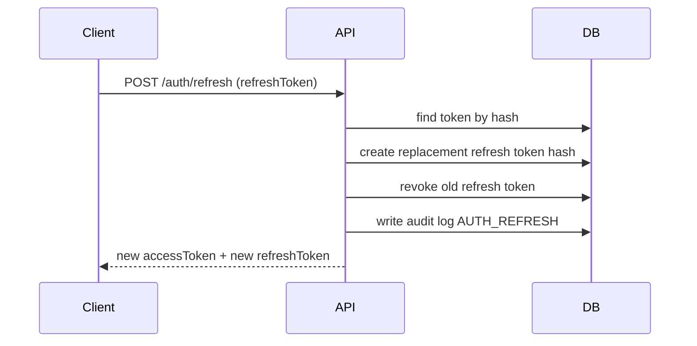

# Auth and Tenancy API (Phase 1)

This document defines the Phase 1 identity API contract and token lifecycle behavior.

## Route Overview

1. `POST /auth/login`
2. `POST /auth/refresh`
3. `POST /auth/logout`
4. `POST /auth/password-reset/initiate`
5. `POST /super-admin/organizations`
6. `POST /org/:orgCode/users/invite`
7. `POST /org/:orgCode/users/activate`

## Login Request

`POST /auth/login`

```json
{
  "email": "admin@acme.com",
  "password": "StrongPass123!",
  "orgCode": "acme"
}
```

Notes:
1. `orgCode` is required for non-super-admin users.
2. Super Admin can log in without `orgCode`.

## Login Response

```json
{
  "accessToken": "...",
  "refreshToken": "...",
  "user": {
    "id": "...",
    "email": "admin@acme.com",
    "firstName": "Acme",
    "lastName": "Admin",
    "roles": ["ORG_ADMIN"],
    "organizationCode": "acme"
  }
}
```

## Token Lifecycle

1. Access tokens are short-lived JWTs.
2. Refresh tokens are rotated on every successful refresh.
3. Refresh tokens are stored as SHA-256 hashes only.
4. Old refresh token is revoked once replacement is created.
5. Logout revokes the current refresh token.

## Sequence: Login



## Sequence: Refresh Rotation



## Tenancy Rules

1. Org routes use `orgCode` path segment (`/org/:orgCode/...`).
2. Access token auth context must match tenant path unless role includes `SUPER_ADMIN`.
3. Cross-tenant requests are denied with `403`.

## Security Controls

1. Password hashing: Argon2id only.
2. Auth endpoint rate limiting enabled.
3. Lockout after repeated failed logins.
4. Audit logs for login, refresh, logout, invite creation, and invite acceptance.
